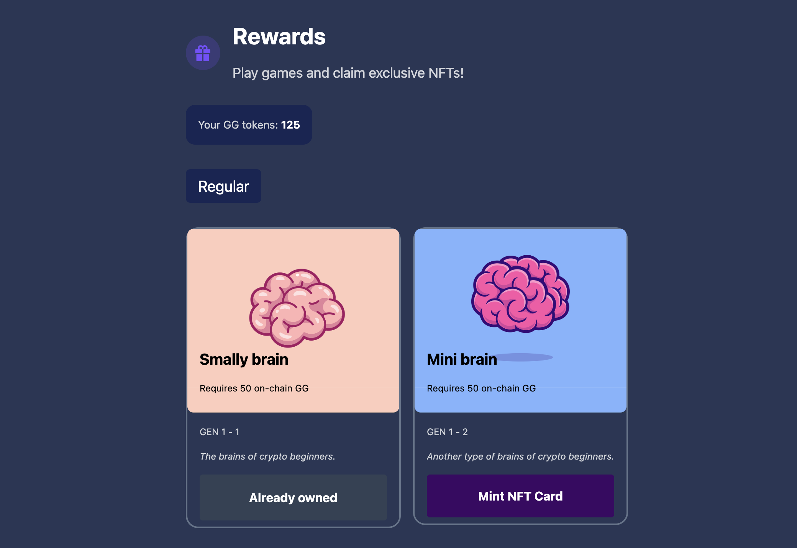

# GameGuild (GG) on 🏗 Scaffold-ETH 2

## About The Project

<p align="center">
  
</p>

Welcome to Game Guild, where engaging your mind leads to exclusive rewards! Embark on an adventure through three captivating games: Number Memory, Chimp Test, and Reaction Test, each designed to challenge your intellect and entertain. As you conquer puzzles and overcome challenges, you'll unlock a variety of NFTs, ranging from regular to silver and gold, available only to our community members. Dive into the cutting-edge intersection of gaming and blockchain technology, where fun meets opportunity. Ready to play, earn, and own?

⚙️ Built using NextJS, RainbowKit, Hardhat, Wagmi, and Typescript.

## Smart contracts

Our core smart contracts are verified on Linea Sepolia and Sepolia testnet.

| Contract           | Linea Sepolia                                                                                                               | Sepolia                                                                                                                       |
| ------------------ | -------------------------------------------------------------------------------------------------------------------------------- | ----------------------------------------------------------------------------------------------------------------------------- |
| `GG ERC20 Token`   | [0x3526c0Fc8453748e08dAA3723A620efaC386EA4f](https://sepolia.lineascan.build/address/0x3526c0fc8453748e08daa3723a620efac386ea4f) | [0xbfcd7fd7506071db94ad478aee027806d47c310d](https://sepolia.etherscan.io/address/0xbfcd7fd7506071db94ad478aee027806d47c310d) |
| `Brain ERC721 NFT` | [0x899C7f51B154d0D009945bC30c21815b0E525d9a](https://sepolia.lineascan.build/address/0x899c7f51b154d0d009945bc30c21815b0e525d9a) | [0x5c72cd6c6a97b0859df4e9796b807f2109e6a8b6](https://sepolia.etherscan.io/address/0x5c72cd6c6a97b0859df4e9796b807f2109e6a8b6) |

## Requirements

Before you begin, you need to install the following tools:

- [Node (>= v18.17)](https://nodejs.org/en/download/)
- Yarn ([v1](https://classic.yarnpkg.com/en/docs/install/) or [v2+](https://yarnpkg.com/getting-started/install))
- [Git](https://git-scm.com/downloads)

## Quickstart

To get started with Scaffold-ETH 2, follow the steps below:

1. Clone this repo & install dependencies

```
git clone https://github.com/scaffold-eth/scaffold-eth-2.git
cd scaffold-eth-2
yarn install
```

2. Run a local network in the first terminal:

```
yarn chain
```

This command starts a local Ethereum network using Hardhat. The network runs on your local machine and can be used for testing and development. You can customize the network configuration in `hardhat.config.ts`.

3. On a second terminal, deploy the test contract:

```
yarn deploy
```

This command deploys a test smart contract to the local network. The contract is located in `packages/hardhat/contracts` and can be modified to suit your needs. The `yarn deploy` command uses the deploy script located in `packages/hardhat/deploy` to deploy the contract to the network. You can also customize the deploy script.

4. On a third terminal, start your NextJS app:

```
yarn start
```

Visit your app on: `http://localhost:3000`. You can interact with your smart contract using the `Debug Contracts` page. You can tweak the app config in `packages/nextjs/scaffold.config.ts`.

**What's next**:

- Edit your smart contract `YourContract.sol` in `packages/hardhat/contracts`
- Edit your frontend homepage at `packages/nextjs/app/page.tsx`. For guidance on [routing](https://nextjs.org/docs/app/building-your-application/routing/defining-routes) and configuring [pages/layouts](https://nextjs.org/docs/app/building-your-application/routing/pages-and-layouts) checkout the Next.js documentation.
- Edit your deployment scripts in `packages/hardhat/deploy`
- Edit your smart contract test in: `packages/hardhat/test`. To run test use `yarn hardhat:test`

## Documentation

Visit our [docs](https://docs.scaffoldeth.io) to learn how to start building with Scaffold-ETH 2.

To know more about its features, check out our [website](https://scaffoldeth.io).

## Contributing to Scaffold-ETH 2

We welcome contributions to Scaffold-ETH 2!

Please see [CONTRIBUTING.MD](https://github.com/scaffold-eth/scaffold-eth-2/blob/main/CONTRIBUTING.md) for more information and guidelines for contributing to Scaffold-ETH 2.
